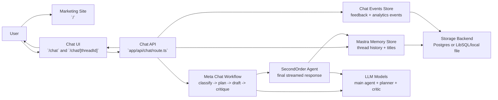
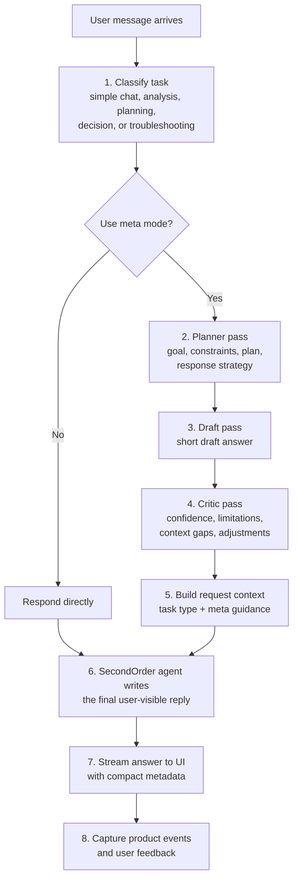

# SecondOrder Architecture Overview

This document gives two shareable views of the current system:

- the product and system architecture
- the meta-thinking flow used for harder chat requests

## High-Level System

### What this means

- The marketing site explains the product and sends people into the chat experience.
- The chat UI talks only to the Next.js chat API route.
- The API route is the orchestration boundary: it validates the request, loads thread history, runs the meta workflow, and streams the final answer back to the UI.
- Mastra provides the workflow engine, agent runtime, memory, and storage integration.
- Thread history and titles live in Mastra memory storage.
- Product analytics events like `thread_started`, `meta_mode_used`, and `feedback_submitted` are recorded separately for measurement.
- Storage can run on Postgres in production or LibSQL/file-backed storage locally.

## Meta-Thinking Process

### How to explain this to a friend

- SecondOrder does not always use a heavy workflow. It first decides whether the request is simple or whether it needs a more structured pass.
- For harder requests, it creates a compact plan before answering.
- It then critiques that draft so the final response can include better framing, clearer limitations, and missing-context signals.
- The user does not see the full hidden chain-of-thought. They get a normal answer plus compact, useful signals about how the system approached the task.
- That makes the product feel like a chat assistant with visible reasoning discipline, not just raw text generation.

## Current Building Blocks

- UI: [`app/page.tsx`](/Users/henry/workspace/secondorder-web/app/page.tsx), [`app/chat/page.tsx`](/Users/henry/workspace/secondorder-web/app/chat/page.tsx), [`app/chat/[threadId]/page.tsx`](/Users/henry/workspace/secondorder-web/app/chat/[threadId]/page.tsx)
- API: [`app/api/chat/route.ts`](/Users/henry/workspace/secondorder-web/app/api/chat/route.ts)
- Workflow: [`mastra/workflows/meta-chat-workflow.ts`](/Users/henry/workspace/secondorder-web/mastra/workflows/meta-chat-workflow.ts)
- Agents and memory: [`mastra/agents.ts`](/Users/henry/workspace/secondorder-web/mastra/agents.ts)
- Runtime wiring: [`mastra/index.ts`](/Users/henry/workspace/secondorder-web/mastra/index.ts)
- Storage and events: [`lib/chat/history.ts`](/Users/henry/workspace/secondorder-web/lib/chat/history.ts), [`lib/chat/events.ts`](/Users/henry/workspace/secondorder-web/lib/chat/events.ts), [`lib/chat/storage.ts`](/Users/henry/workspace/secondorder-web/lib/chat/storage.ts)
